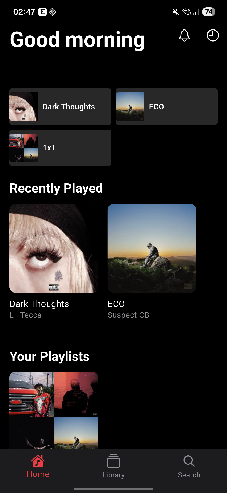
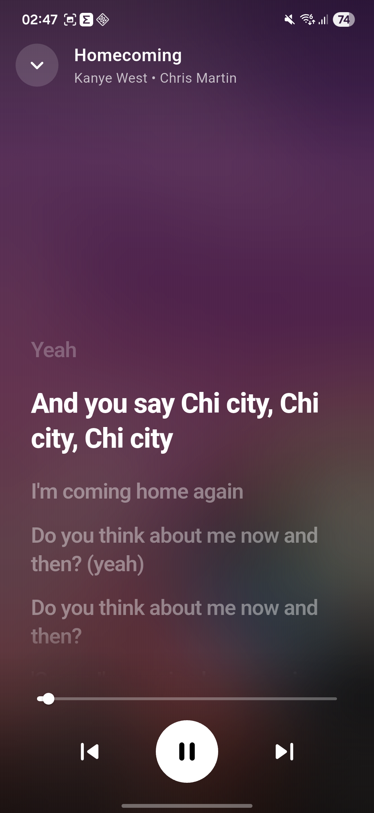
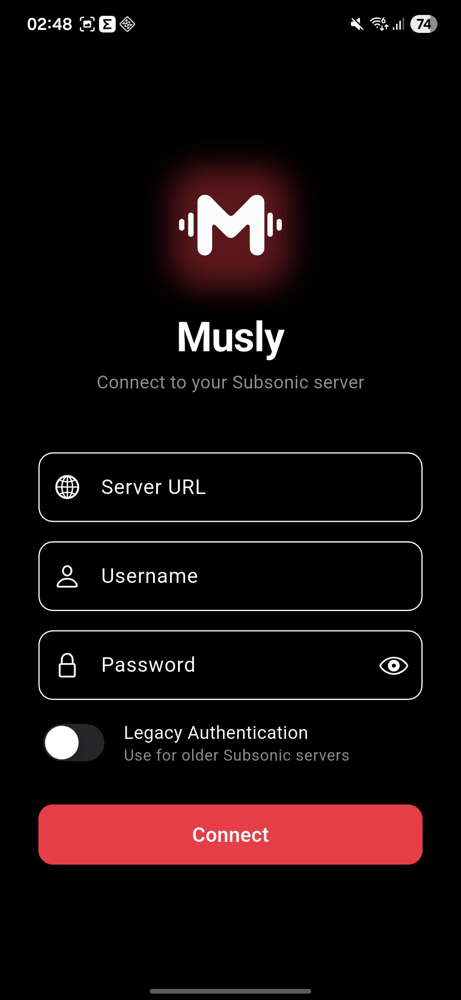

<div align="center">
  <a href="https://www.youtube.com/watch?v=JvHzI9AZM0A">
    
  </a>
</div>

# Musly - Best Free Navidrome Client & Subsonic Music Player

**Musly** is a free **Navidrome client** and **Subsonic music player** with a beautiful Apple Music-inspired interface. Stream your self-hosted music library from Navidrome, Subsonic, or Airsonic servers on Android, iOS, Windows, Linux, and macOS.

🌐 **Website:** [musly.devid.lol](https://musly.devid.lol/)

[](https://github.com/dddevid/Musly/releases/tag/v1.0.13)
[](https://musly.devid.lol)
[](https://musly.devid.lol)

## Why Choose Musly as Your Navidrome Client?

Musly is the best Navidrome client for 2026, offering:

- 🎵 **Music Streaming** - Stream music from your Subsonic server
- 🎨 **Apple Music UI** - Beautiful, modern interface inspired by Apple Music
- 🌙 **Dark/Light Mode** - Automatic theme switching based on system settings
- 📱 **Responsive Design** - Works on phones and tablets
- 🔍 **Search** - Search artists, albums, and songs
- 📚 **Library** - Browse your music collection
- 📋 **Playlists** - View and manage playlists
- ▶️ **Now Playing** - Full-featured music player with controls
- 🔀 **Shuffle & Repeat** - Control playback modes
- 📊 **Queue Management** - View and modify the play queue
- 🚗 **Android Auto** - Full support for Android Auto integration
- 🎧 **Synced Lyrics** - Time-synced lyrics with Apple Music–style desktop fullscreen mode
- 🧠 **Smart Recommendations** - Personalized mixes, "For You" feed, and listening history

### Prerequisites

- Flutter SDK 3.10.0 or higher
- A Subsonic-compatible music server (Subsonic, Navidrome, Airsonic, etc.)

## Supported Platforms

Musly is a cross-platform application that supports:
- 📱 **Android**
- 🍏 **iOS**
- 🪟 **Windows**
- 🐧 **Linux**
- 🍎 **macOS**

## Download Musly - Best Navidrome Client

You can download the latest release of Musly (the best Navidrome client):
👉 **[Download Musly v1.0.13 - Navidrome Client](https://github.com/dddevid/Musly/releases/tag/v1.0.13)**

## Community

Join our Discord community to get support, share feedback, and connect with other Musly users!

<div align="center">

[](https://discord.gg/k9FqpbT65M)

**[Join Discord Server](https://discord.gg/k9FqpbT65M)** 💬

</div>

## 💖 Support the Project

If you find Musly useful and want to support its development

| Network | Address |
| :--- | :--- |
| **Bitcoin (BTC)** | `bc1qrfv880kc8qamanalc5kcqs9q5wszh90e5eggyz` |
| **Solana (SOL)** | `E3JUcjyR6UCJtppU24iDrq82FyPeV9nhL1PKHx57iPXu` |
| **ETH / Monad / Hype** | `0x01195b0Ae97b2D461aB0C746663bFE915eb9ac7c` |

---

## Roadmap

- [x] **Custom PC UX**: Basic desktop layout with persistent sidebar and dedicated player bar.
- [x] **Desktop Lyrics & Fullscreen Mode**: Apple Music–style synced lyrics view with smooth scrolling and true fullscreen on desktop.
- [-] **CarPlay Support**: Add a dedicated browsing interface for CarPlay. (Carplay needs a signed certificate, until the app is available on the appstore carplay wont work, only if selfsigned and with carplay enabled in the code)
- [X] **Local Playlists**: Manage playlists locally, independent of the Subsonic server.
- [ ] **Custom API Server**: Support for custom backend implementations and extended APIs.
- [X] Improved synchronization for offline music.
- [ ] Tizen OS (Samsung TV) and WebOS (LG TV) port
- [X] Jellyfin / Emby support

## Screenshots

<p align="center">
  
  
  
  
</p>

## Star History

<a href="https://www.star-history.com/?repos=dddevid%2Fmusly&type=date&legend=top-left">
 <picture>
   <source media="(prefers-color-scheme: dark)" srcset="https://api.star-history.com/image?repos=dddevid/musly&type=date&theme=dark&legend=top-left" />
   <source media="(prefers-color-scheme: light)" srcset="https://api.star-history.com/image?repos=dddevid/musly&type=date&legend=top-left" />
   
 </picture>
</a>

## Installation

1. Install dependencies:
   ```bash
   flutter pub get
   ```
2. Run the app:
   ```bash
   flutter run
   ```

### Connecting to Your Server

1. Launch the app
2. Enter your Subsonic server URL (e.g., `https://your-server.com`)
3. Enter your username and password
4. Toggle "Legacy Authentication" if using an older server
5. Tap "Connect"

## Translations

Musly is translated into 24+ languages! Help translate Musly into your language:

📝 **[Contribute on Crowdin](https://crowdin.com/project/musly)**

See [TRANSLATIONS.md](TRANSLATIONS.md) for a complete guide on how to contribute translations.

## Supported Servers

Musly works with any Subsonic API-compatible server:

- [Navidrome](https://www.navidrome.org/) - **Best with Musly!**
- [Subsonic](http://www.subsonic.org/)
- [Airsonic](https://airsonic.github.io/)
- [Gonic](https://github.com/sentriz/gonic)

## License

> [!IMPORTANT]
> **DO NOT redistribute this app to the Google Play Store or other commercial stores.**

This project is open source and available under the **Creative Commons Attribution-NonCommercial-ShareAlike 4.0 International (CC BY-NC-SA 4.0)** License. See the [LICENSE](LICENSE) file for details.

---

<div align="center">
  <sub>Made with  in Italy  by an Albanian developer </sub>
</div>

<br/>

<div align="center">

[](https://github.com/dddevid/Musly)


</div>
